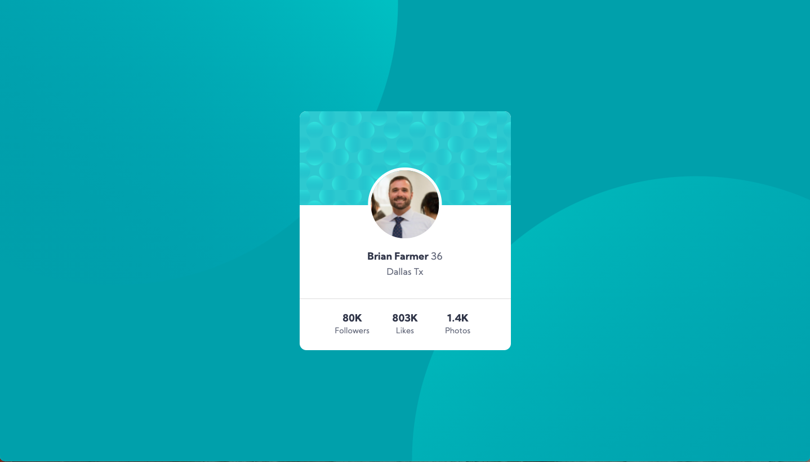

# Frontend Mentor - Profile card component solution

This is a solution to the [Profile card component challenge on Frontend Mentor](https://www.frontendmentor.io/challenges/profile-card-component-cfArpWshJ). Frontend Mentor challenges help you improve your coding skills by building realistic projects.

## Table of contents

- [Overview](#overview)
  - [The challenge](#the-challenge)
  - [Screenshot](#screenshot)
  - [Links](#links)
- [My process](#my-process)
  - [Built with](#built-with)
  - [What I learned](#what-i-learned)
  - [Continued development](#continued-development)
  - [Useful resources](#useful-resources)
- [Author](#author)

## Overview

### The challenge

- Build out the project to the designs provided

### Screenshot



### Links

- Solution URL: [https://www.frontendmentor.io/solutions/profile-card-grid-layout-practice-98ETvGEzS](https://www.frontendmentor.io/solutions/profile-card-grid-layout-practice-98ETvGEzS)
- Live Site URL: [https://fem-blf-profile-card.netlify.app/](https://fem-blf-profile-card.netlify.app/)

## My process

### Built with

- Semantic HTML5 markup
- SASS Pre-Processor
- CSS custom properties
- Display Grid

### What I learned

I had two goals in mind while doing this project.

1 - Create the layout only using display grid. I've gotten in the habit on relying 95% on flexbox and I need to practice using grid more.

2 - Really work on positioning background images in a more precise manner. I found that I could place and keep the background images in the correct position using edge offset values in the background position where before I was just trying to use percentage values with no edge reference. This worked so much better.

```css
main {
  min-height: 100vh;
  background: url("../assets/images/bg-pattern-top.svg"),
    url("../assets/images/bg-pattern-bottom.svg"), $background;
  background-repeat: no-repeat;
  background-size: 70%;
  /* Using edge offset values */
  background-position: left -300px top -500px, right -300px bottom -500px;
  display: grid;
  place-items: center;
}
```

### Continued development

Flexbox is powerful but so is grid and I need to focus on learning when to use which display style to better suit the situation. I plan on continuing to work with using display grid on increasingly more chalanging layouts in order to better understand its functionality.

### Useful resources

- [Good read on background positioning](https://developer.mozilla.org/en-US/docs/Web/CSS/background-position) - Before reading this I did not realize I could combine the keyword values like top, bottom, left, right, and center with percentage values in order to create edge offsets.
- [Great video on simple layouts](https://www.youtube.com/watch?v=qm0IfG1GyZU&t=1096s) - I thought the visuals the instructor provides in the video really show the power and built in responsiveness that both flexbox and grid can provide if you know how to use these tools correctly. Not super in depth but gets you interested in looking further.

## Author

- Website - [Portfolio Site](https://brianfarmerwebdev.netlify.app)
- GitHub URL: - [GitHub URL](https://github.com/brianlfarmerllc/fem_profile_card)
- Frontend Mentor - [@brianlfarmerllc](https://www.frontendmentor.io/profile/brianlfarmerllc)
